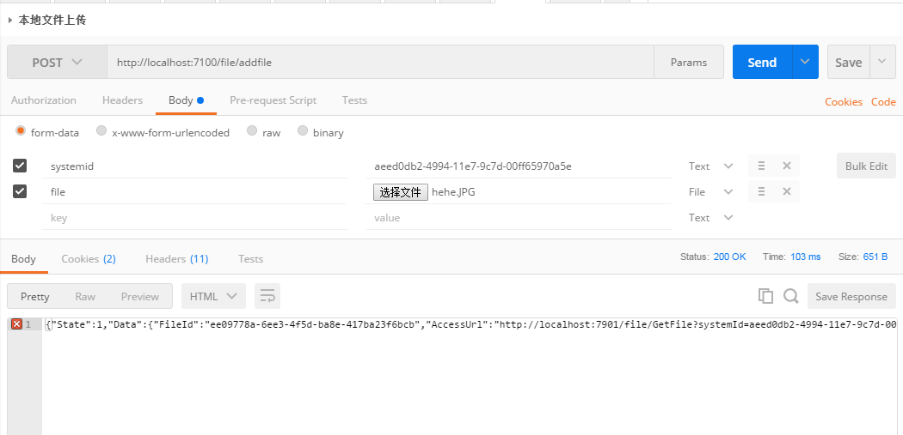

 
## 日志服务

以WebApi的方式提供统一的文件上传下载服务,图片缩放和水印服务(基于.NetFramework4.5,写于2015年)

<br/><br/>

---

### 部署说明

在mysql数据库上运行database.sql,以创建库表结构.

<br/>
打开FileServer.sln解决方案,分别右击FileInApi项目和FileOutApi项目选择发布,将这两个网站分别发布到您磁盘的不同目录下.

<br/>
分别修改两个网站的web.config中的数据库链接字符串,以及log4net配置部分的MariaDBAppender的数据库连接字符串(用于记录系统本身的日志).


<br/>
<br/>
在IIS(IIS7)以上新建两个网站(而不是添加应用程序),分别指向刚才的两个发布目录,应用程序池选择NetFramework4.0版本.

<br/>
<br/>

修改FileInApi的Set.config的Ex部分,设置文件上传的目录和上传文件大小限制,以及文件下载服务的网站地址:

```xml
  <Ex>
    <!--上传的文件的保存到这个根目录下-->
    <FileUploadRootPath><![CDATA[D:\_File\]]></FileUploadRootPath>
    <!--上传文件最大大小,M为单位-->
    <FileMaxSize><![CDATA[100]]></FileMaxSize>
    <!--文件下载服务的Api地址-->
    <FileOutServerURL><![CDATA[http://localhost:7901]]></FileOutServerURL>
  </Ex>
```

<br/>
修改FileOutApi的Set.config的Ex部分,设置文件所存放的目录和缓存文件目录:

```xml
<Ex>
    <File>
      <!--和文件上传服务中所配置的文件根目录一样-->
      <FileUploadRootPath><![CDATA[D:\_File\]]></FileUploadRootPath>
      <!--文件缓存目录,用于存放自动生成的缓存文件-->
      <ImageCacheRootPath>
        <![CDATA[D:\_File\ImageCache\]]>
      </ImageCacheRootPath>
    </File>
  </Ex>
```

<br/>
 
 都配置完以后,分别重启两个网站使配置生效.

---

### 接口说明
 
<table class="confluenceTable"><colgroup><col><col><col><col><col><col></colgroup><tbody><tr><th class="confluenceTh">接口名称</th><th class="confluenceTh">接口地址</th><th class="confluenceTh">参数说明</th><th class="confluenceTh">请求方式</th><th class="confluenceTh">返回值</th><th class="confluenceTh"><span>备注</span></th></tr><tr><td class="confluenceTd">上传单个文件</td><td class="confluenceTd">file\AddFile</td><td class="confluenceTd">

<table class="confluenceTable"><tbody><tr><th class="confluenceTh">参数名</th><th class="confluenceTh">参数类型</th><th class="confluenceTh">备注</th></tr><tr><td class="confluenceTd">systemId</td><td class="confluenceTd">string</td><td class="confluenceTd">业务系统的ID,每个业务系统一个固定的ID,由接入时分配</td></tr><tr><td class="confluenceTd">file</td><td class="confluenceTd">file</td><td class="confluenceTd">要上传的文件,通过form上传</td></tr><tr><td colspan="1" class="confluenceTd">createId</td><td colspan="1" class="confluenceTd">string</td><td colspan="1" class="confluenceTd">可选,用于区分业务系统中是哪个用户上传的文件,如果传了,在删除文件时只有该用户才能删除</td></tr></tbody></table>

</td><td class="confluenceTd">POST/Form</td><td class="confluenceTd"><span style="color: rgb(74,85,96)">{</span>
<span style="color: rgb(74,85,96)">&nbsp;&nbsp;&nbsp;&nbsp;</span><span class="json_key" style="color: rgb(146,39,143)">"State"</span><span style="color: rgb(74,85,96)">:</span><span class="json_number" style="color: rgb(37,170,226)">1</span><span style="color: rgb(74,85,96)">,</span>
<span style="color: rgb(74,85,96)">&nbsp;&nbsp;&nbsp;&nbsp;</span><span class="json_key" style="color: rgb(146,39,143)">"Data"</span><span style="color: rgb(74,85,96)">:</span><span style="color: rgb(74,85,96)">{
&nbsp;&nbsp;&nbsp;&nbsp;&nbsp;&nbsp;&nbsp;&nbsp;<span class="json_key" style="color: rgb(146,39,143)">"FileId"</span>:<span class="json_string" style="color: rgb(58,181,74)">"36458056-6288-4c18-88e1-a42ff3416345"</span>,
&nbsp;&nbsp;&nbsp;&nbsp;&nbsp;&nbsp;&nbsp;&nbsp;<span class="json_key" style="color: rgb(146,39,143)">"AccessUrl"</span>:<span class="json_string" style="color: rgb(58,181,74)">"[http://localhost:7901/file/GetFile?systemId=7ea62630-4994-11e7-9c7d-00ff659703f8&amp;fileId=36458056-6288-4c18-88e1-a42ff3416345](http://localhost:7901/file/GetFile?systemId=7ea62630-4994-11e7-9c7d-00ff659703f8&amp;fileId=36458056-6288-4c18-88e1-a42ff3416345)"</span>,
&nbsp;&nbsp;&nbsp;&nbsp;&nbsp;&nbsp;&nbsp;&nbsp;<span class="json_key" style="color: rgb(146,39,143)">"FileName"</span>:<span class="json_string" style="color: rgb(58,181,74)">"libexpat-1.dll"</span>
&nbsp;&nbsp;&nbsp;&nbsp;}</span>
<span style="color: rgb(74,85,96)">}</span>
</td><td class="confluenceTd">

State为1时代表成功,Data为对象,

Data中的FileId表示该 文件的ID,

Data中的AccessUrl表示该文件的访问地址.

Data中的FileName表示文件名称.

<span>请业务系将FileId或AccessUrl统保存到库中,将来访问该文件时会用到,**推荐保存FileId**.(将来服务地址变更时只要改访问前缀的配置,不用改数据库存放的内容)</span>

State为其它时,Data为具体失败的原因
</td></tr><tr><td class="confluenceTd" colspan="1">上传多个文件</td><td colspan="1" class="confluenceTd"><span>file\AddFiles</span></td><td colspan="1" class="confluenceTd">

<table class="confluenceTable"><tbody><tr><th class="confluenceTh">参数名</th><th class="confluenceTh">参数类型</th><th class="confluenceTh">备注</th></tr><tr><td class="confluenceTd">systemId</td><td class="confluenceTd">string</td><td class="confluenceTd">业务系统的ID,每个业务系统一个固定的ID,由接入时分配</td></tr><tr><td class="confluenceTd">files</td><td class="confluenceTd">file</td><td class="confluenceTd">要上传的多个文件,通过form上传</td></tr><tr><td class="confluenceTd">createId</td><td class="confluenceTd">string</td><td class="confluenceTd">可选,用于区分业务系统中是哪个用户上传的文件,如果传了,在删除文件时只有该用户才能删除</td></tr></tbody></table>

</td><td colspan="1" class="confluenceTd"><span>POST/Form</span></td><td colspan="1" class="confluenceTd"><span style="color: rgb(74,85,96)">[</span>
<span style="color: rgb(74,85,96)">&nbsp;&nbsp;&nbsp;&nbsp;</span><span style="color: rgb(74,85,96)">{
&nbsp;&nbsp;&nbsp;&nbsp;&nbsp;&nbsp;&nbsp;&nbsp;<span class="json_key" style="color: rgb(146,39,143)">"State"</span>:<span class="json_number" style="color: rgb(37,170,226)">1</span>,
&nbsp;&nbsp;&nbsp;&nbsp;&nbsp;&nbsp;&nbsp;&nbsp;<span class="json_key" style="color: rgb(146,39,143)">"Data"</span>:<span>{
&nbsp;&nbsp;&nbsp;&nbsp;&nbsp;&nbsp;&nbsp;&nbsp;&nbsp;&nbsp;&nbsp;&nbsp;<span class="json_key" style="color: rgb(146,39,143)">"FileId"</span>:<span class="json_string" style="color: rgb(58,181,74)">"1b244b9d-7a4f-48fd-b3ad-fb9f33a7bb7f"</span>,
&nbsp;&nbsp;&nbsp;&nbsp;&nbsp;&nbsp;&nbsp;&nbsp;&nbsp;&nbsp;&nbsp;&nbsp;<span class="json_key" style="color: rgb(146,39,143)">"AccessUrl"</span>:<span class="json_string" style="color: rgb(58,181,74)">"[http://localhost:7901/file/GetFile?systemId=7ea62630-4994-11e7-9c7d-00ff659703f8&amp;fileId=1b244b9d-7a4f-48fd-b3ad-fb9f33a7bb7f](http://localhost:7901/file/GetFile?systemId=7ea62630-4994-11e7-9c7d-00ff659703f8&amp;fileId=1b244b9d-7a4f-48fd-b3ad-fb9f33a7bb7f)"</span>,
&nbsp;&nbsp;&nbsp;&nbsp;&nbsp;&nbsp;&nbsp;&nbsp;&nbsp;&nbsp;&nbsp;&nbsp;<span class="json_key" style="color: rgb(146,39,143)">"FileName"</span>:<span class="json_string" style="color: rgb(58,181,74)">"libpng14-14.dll"</span>
&nbsp;&nbsp;&nbsp;&nbsp;&nbsp;&nbsp;&nbsp;&nbsp;}</span>
&nbsp;&nbsp;&nbsp;&nbsp;}</span><span style="color: rgb(74,85,96)">,</span>
<span style="color: rgb(74,85,96)">&nbsp;&nbsp;&nbsp;&nbsp;</span><span style="color: rgb(74,85,96)">{
&nbsp;&nbsp;&nbsp;&nbsp;&nbsp;&nbsp;&nbsp;&nbsp;<span class="json_key" style="color: rgb(146,39,143)">"State"</span>:<span class="json_number" style="color: rgb(37,170,226)">1</span>,
&nbsp;&nbsp;&nbsp;&nbsp;&nbsp;&nbsp;&nbsp;&nbsp;<span class="json_key" style="color: rgb(146,39,143)">"Data"</span>:<span>{
&nbsp;&nbsp;&nbsp;&nbsp;&nbsp;&nbsp;&nbsp;&nbsp;&nbsp;&nbsp;&nbsp;&nbsp;<span class="json_key" style="color: rgb(146,39,143)">"FileId"</span>:<span class="json_string" style="color: rgb(58,181,74)">"9b164dcc-1ca6-41fe-8b45-f64cc731dcc0"</span>,
&nbsp;&nbsp;&nbsp;&nbsp;&nbsp;&nbsp;&nbsp;&nbsp;&nbsp;&nbsp;&nbsp;&nbsp;<span class="json_key" style="color: rgb(146,39,143)">"AccessUrl"</span>:<span class="json_string" style="color: rgb(58,181,74)">"[http://localhost:7901/file/GetFile?systemId=7ea62630-4994-11e7-9c7d-00ff659703f8&amp;fileId=9b164dcc-1ca6-41fe-8b45-f64cc731dcc0](http://localhost:7901/file/GetFile?systemId=7ea62630-4994-11e7-9c7d-00ff659703f8&amp;fileId=9b164dcc-1ca6-41fe-8b45-f64cc731dcc0)"</span>,
&nbsp;&nbsp;&nbsp;&nbsp;&nbsp;&nbsp;&nbsp;&nbsp;&nbsp;&nbsp;&nbsp;&nbsp;<span class="json_key" style="color: rgb(146,39,143)">"FileName"</span>:<span class="json_string" style="color: rgb(58,181,74)">"license.txt"</span>
&nbsp;&nbsp;&nbsp;&nbsp;&nbsp;&nbsp;&nbsp;&nbsp;}</span>
&nbsp;&nbsp;&nbsp;&nbsp;}</span>
<span style="color: rgb(74,85,96)">]</span></td><td colspan="1" class="confluenceTd">

返回值的解释请参照上传单个文件,

只是分别为每个文件返回了上传结果.
</td></tr><tr><td class="confluenceTd">删除文件</td><td class="confluenceTd">file\DeleteFile</td><td class="confluenceTd">

<table class="confluenceTable"><tbody><tr><th class="confluenceTh">参数名</th><th class="confluenceTh">参数类型</th><th class="confluenceTh">备注</th></tr><tr><td class="confluenceTd">systemId</td><td class="confluenceTd">string</td><td class="confluenceTd">业务系统的ID,每个业务系统一个固定的ID,由接入时分配</td></tr><tr><td class="confluenceTd">fileId</td><td class="confluenceTd">string</td><td class="confluenceTd">文件的id</td></tr><tr><td colspan="1" class="confluenceTd">createId</td><td colspan="1" class="confluenceTd">string</td><td colspan="1" class="confluenceTd"><span>可选,用于区分业务系统中是哪个用户上传的文件,如果上传文件时传递了该值,在删除文件时也必须传(只有该用户才能删除)</span></td></tr></tbody></table>

</td><td class="confluenceTd">POST/json</td><td class="confluenceTd"><span style="color: rgb(74,85,96)">{</span>
<span style="color: rgb(74,85,96)">&nbsp;&nbsp;&nbsp;&nbsp;</span><span class="json_key" style="color: rgb(146,39,143)">"State"</span><span style="color: rgb(74,85,96)">:</span><span class="json_number" style="color: rgb(37,170,226)">1</span><span style="color: rgb(74,85,96)">,</span>
<span style="color: rgb(74,85,96)">&nbsp;&nbsp;&nbsp;&nbsp;</span><span class="json_key" style="color: rgb(146,39,143)">"Data"</span><span style="color: rgb(74,85,96)">:</span><span class="json_null" style="color: rgb(241,89,42)">null</span>
<span style="color: rgb(74,85,96)">}</span></td><td class="confluenceTd">

<span>State为1时代表成功,Data为null,</span>

<span>
</span>

<span><span>State为其它时,Data为具体失败的原因</span>
</span>
</td></tr></tbody></table>

文件下载服务:
 
<table class="confluenceTable"><colgroup><col><col><col><col><col><col></colgroup><tbody><tr><th class="confluenceTh">接口名称</th><th class="confluenceTh">接口地址</th><th class="confluenceTh">参数说明</th><th class="confluenceTh">请求方式</th><th class="confluenceTh">返回值</th><th class="confluenceTh">备注</th></tr><tr><td class="confluenceTd">下载文件</td><td class="confluenceTd">file\GetFile</td><td class="confluenceTd">

<table class="confluenceTable"><tbody><tr><th class="confluenceTh">参数名</th><th class="confluenceTh">参数值</th><th class="confluenceTh">备注</th></tr><tr><td class="confluenceTd">systemId</td><td class="confluenceTd">string</td><td class="confluenceTd">业务系统的ID,每个业务系统一个固定的ID,由接入时分配</td></tr><tr><td class="confluenceTd">fileId</td><td class="confluenceTd">string</td><td class="confluenceTd">文件的id</td></tr><tr><td class="confluenceTd"><span>width</span></td><td class="confluenceTd">int</td><td class="confluenceTd">

可选,用于获取指定宽度的图片,该参数只对图片类型的文件有效

要求与height参数并用
</td></tr><tr><td class="confluenceTd"><span>height</span></td><td class="confluenceTd">int</td><td class="confluenceTd">

<span>可选,用于获取指定高度的图片,该参数只对图片类型的文件有效</span>

<span>要求与width参数并用</span>
</td></tr><tr><td class="confluenceTd"><span>addWater</span></td><td class="confluenceTd">int</td><td class="confluenceTd">可选 0或1,用于对图片添加水印,为1时添加,<span>该参数只对图片类型的文件有效</span></td></tr><tr><td class="confluenceTd"><span>waterFontSize</span></td><td class="confluenceTd">int</td><td class="confluenceTd"><span>可选,用于设置图片水印的字号大小,该参数只对图片类型的文件有效</span></td></tr><tr><td class="confluenceTd"><span>waterText</span></td><td class="confluenceTd">string</td><td class="confluenceTd">可选,用于设置图片的文印文字,<span>该参数只对图片类型的文件有效</span></td></tr></tbody></table>

</td><td class="confluenceTd">get</td><td class="confluenceTd">文件\图片</td><td class="confluenceTd">

正常情况下是返回一个图片或文件,

当发生错误时,会返回json表示具体的错误原因

<span style="color: rgb(74,85,96)">{</span>
<span style="color: rgb(74,85,96)">&nbsp;&nbsp;&nbsp;&nbsp;</span><span class="json_key" style="color: rgb(146,39,143)">"State"</span><span style="color: rgb(74,85,96)">:</span><span class="json_number" style="color: rgb(37,170,226)">0</span><span style="color: rgb(74,85,96)">,</span>
<span style="color: rgb(74,85,96)">&nbsp;&nbsp;&nbsp;&nbsp;</span><span class="json_key" style="color: rgb(146,39,143)">"Data"</span><span style="color: rgb(74,85,96)">:</span><span class="json_string" style="color: rgb(58,181,74)">"文件信息不存在"</span>
<span style="color: rgb(74,85,96)">}</span>

</td></tr></tbody></table>


---

### 使用方式

**上传文件**

上传前的准备:

1,请先在biz_system表里添加业务系统的信息,id字段就是业务系统的systemId,一般用guid.

2,重启两个网站(目的是刷新缓存中的业务系统信息))或用PostMan调用两个网站FileController中的RefreshSystemList方法,该方法参数的systemId是Set.config中配置的,不是数据库中的.


备注:为节省磁盘空间,同一文件重复上传只会保存一次文件(根据文件的MD5判定是否是相同文件),但会在数据库中分别存放上传的信息(文件的引用信息).

<br/>

上传文件:


下边是Web方式上传的代码,供参考:

```html
<html>
    <head>
        <meta charset="utf-8">
        <script src="jquery.js"></script>
        <script src="jquery.plugin.migrate1.2.1.js"></script>
 
    </head>
 
    <body>
        <form id="uploadForm">
            <input type="hidden" name="systemid" value="aeed0db2-4994-11e7-9c7d-00ff65970a5e" />
            <input type="file" name="file" />
            <input type="button" value="upload" onclick="doUpload();" />
        </form>
    </body>
    <script type="text/javascript">
        function doUpload() {
 
            var formData = new FormData($("#uploadForm")[0]);
            $.ajax({
                url: 'http://localhost:7100/file/AddFile',
                type: 'POST',
                data: formData,
                contentType: false,
                processData: false,
                success: function(returndata) {
                    alert(returndata);
                },
                error: function(returndata) {
                    alert(returndata);
                }
            });
        }
    </script>
 
</html>
```

**下载文件**

文件上传成功后,返回的数据中Data字段里有文件的下载路径,直接访问下载路径即可,对于非图片文件width,height,addWater,waterFontSize,waterText等图片处理的参数不起作用,直接返回原文件,对于图片类型的文件,会根据这些参数按原图比例加工成指定大小的图片.

 

下边附上PostMan的调用参数与返回值截图:

上传文件:



下载文件:

 


<br/>
<br/>
最后祝大家使用愉快,如果有帮助到您,记得点个星,再见不负遇见!
